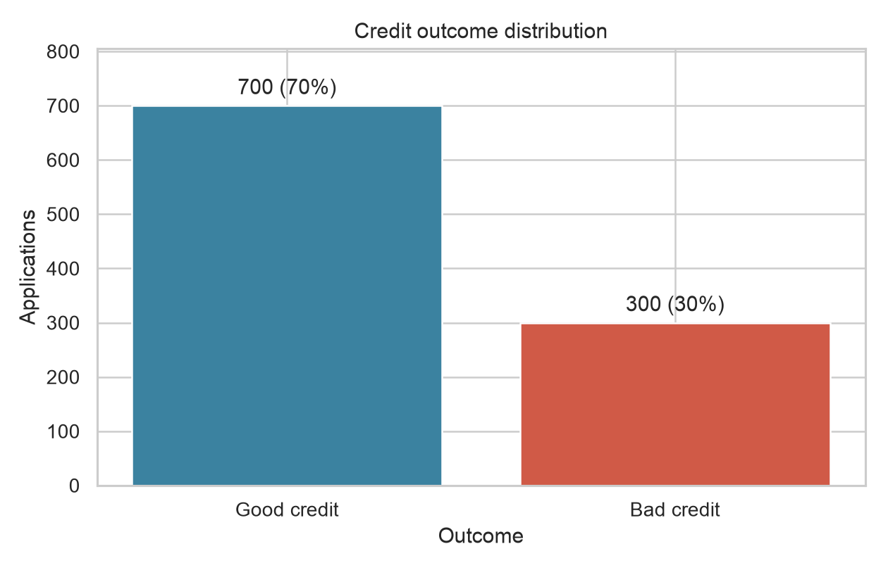
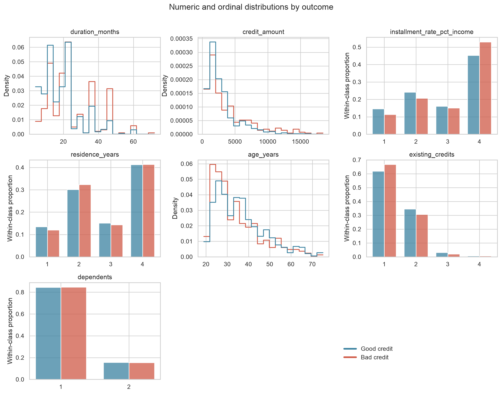
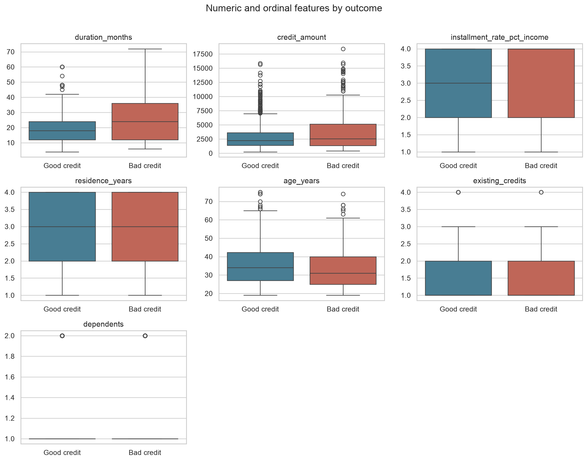
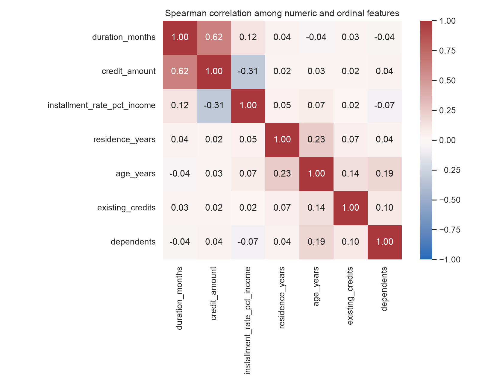
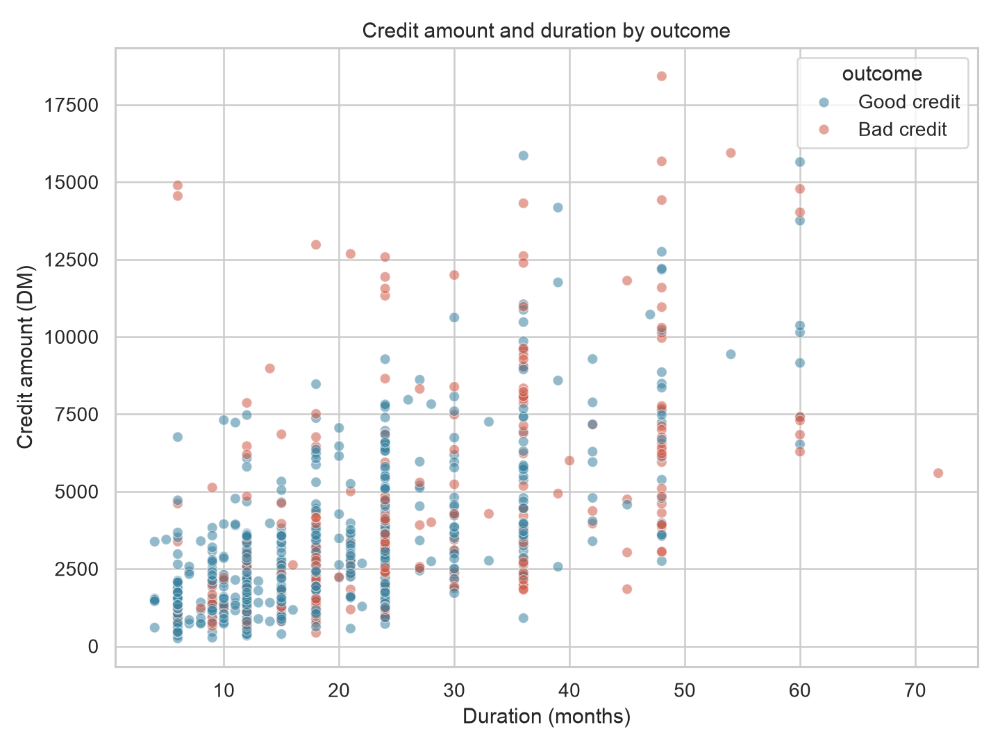
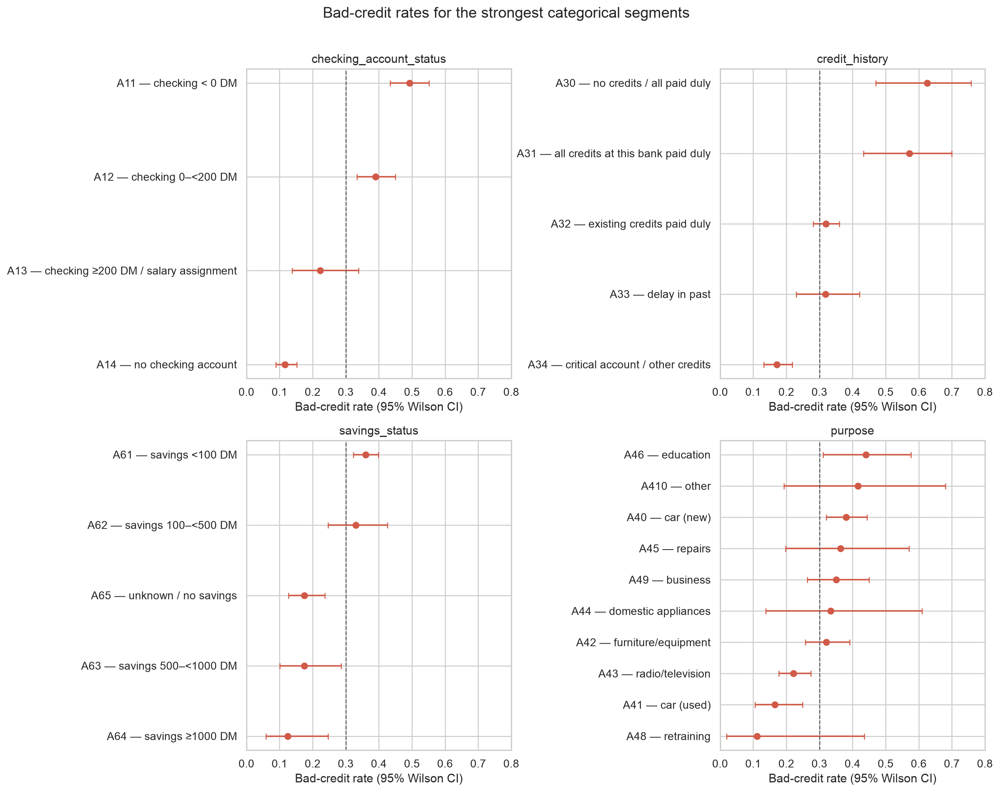

# Exploratory Data Analysis: German Credit Data

**Source snapshot:** `data/german_credit.csv`  
**Analysis date:** 2026-08-08  
**Report scope:** descriptive EDA of the supplied file; no model fitting or causal claims

## Executive summary

The file contains **1,000 credit applications, 20 predictors, and one binary outcome**. Class `1` denotes good credit (700; 70.0%) and class `2` denotes bad credit (300; 30.0%). The snapshot is technically clean: all 21,000 cells are populated, no exact rows or predictor vectors are duplicated, numeric values stay inside their documented domains, and categorical codes have consistent formatting.

The strongest univariate relationship with the outcome is checking-account status (Cramér's V = 0.352), followed by credit history (0.248). For example, the observed bad-credit rate is 49.3% for applicants with a negative checking balance (`A11`, n=274) versus 11.7% for those with no checking account (`A14`, n=394). These are **unadjusted associations**, not evidence that an attribute causes repayment outcomes.

Among numeric fields, longer duration (r = 0.215) and larger credit amount (r = 0.155) are associated with the bad-credit class. Duration and amount are themselves moderately correlated (Spearman ρ = 0.625), so their individual relationships should not be treated as independent effects.

The main risks are contextual rather than cell-level: there is no applicant identifier, timestamp, extraction metadata, or production lineage; several categories are small; the data uses legacy Deutsche Mark bands; and `personal_status_sex`, age, and foreign-worker status raise fairness and governance concerns. This dataset is appropriate for learning and offline benchmarking, but not sufficient by itself for current lending decisions.



## 1. Dataset structure and grain

- **Rows:** 1,000
- **Columns:** 21 = 13 categorical dimensions, 7 numeric/ordinal/count predictors, and 1 binary target
- **Approximate file size:** 78.2 KiB
- **Grain:** one row appears to represent one credit application
- **Primary key:** none supplied; no column is an identifier
- **Candidate uniqueness:** 0 exact duplicate rows; 0 duplicated 20-feature predictor vectors
- **Temporal coverage / last update:** not assessable because the file has no date, timestamp, or load metadata
- **Target:** `class=1` good credit; `class=2` bad credit

The seven numeric-looking predictors include two continuous/count-like measures (`duration_months`, `credit_amount`), age, two counts, and two bounded ordinal ratings. The integer target is categorical, not a metric. There are no date, free-text, Boolean, JSON, or foreign-key columns.

### Column profile

| Raw         | Semantic name               | Role                  | Type  | Missing | Distinct | Most common values                              |
| ----------- | --------------------------- | --------------------- | ----- | ------- | -------- | ----------------------------------------------- |
| Attribute1  | checking_account_status     | Categorical dimension | str   | 0.0%    | 4        | A14: 394; A11: 274; A12: 269; A13: 63           |
| Attribute2  | duration_months             | Numeric metric        | int64 | 0.0%    | 33       | 24: 184; 12: 179; 18: 113; 36: 83; 6: 75        |
| Attribute3  | credit_history              | Categorical dimension | str   | 0.0%    | 5        | A32: 530; A34: 293; A33: 88; A31: 49; A30: 40   |
| Attribute4  | purpose                     | Categorical dimension | str   | 0.0%    | 10       | A43: 280; A40: 234; A42: 181; A41: 103; A49: 97 |
| Attribute5  | credit_amount               | Numeric metric        | int64 | 0.0%    | 921      | 1393: 3; 1262: 3; 1478: 3; 1258: 3; 1275: 3     |
| Attribute6  | savings_status              | Categorical dimension | str   | 0.0%    | 5        | A61: 603; A65: 183; A62: 103; A63: 63; A64: 48  |
| Attribute7  | employment_since            | Categorical dimension | str   | 0.0%    | 5        | A73: 339; A75: 253; A74: 174; A72: 172; A71: 62 |
| Attribute8  | installment_rate_pct_income | Ordinal metric        | int64 | 0.0%    | 4        | 4: 476; 2: 231; 3: 157; 1: 136                  |
| Attribute9  | personal_status_sex         | Categorical dimension | str   | 0.0%    | 4        | A93: 548; A92: 310; A94: 92; A91: 50            |
| Attribute10 | other_debtors_guarantors    | Categorical dimension | str   | 0.0%    | 3        | A101: 907; A103: 52; A102: 41                   |
| Attribute11 | residence_years             | Ordinal metric        | int64 | 0.0%    | 4        | 4: 413; 2: 308; 3: 149; 1: 130                  |
| Attribute12 | property                    | Categorical dimension | str   | 0.0%    | 4        | A123: 332; A121: 282; A122: 232; A124: 154      |
| Attribute13 | age_years                   | Numeric metric        | int64 | 0.0%    | 53       | 27: 51; 26: 50; 23: 48; 24: 44; 28: 43          |
| Attribute14 | other_installment_plans     | Categorical dimension | str   | 0.0%    | 3        | A143: 814; A141: 139; A142: 47                  |
| Attribute15 | housing                     | Categorical dimension | str   | 0.0%    | 3        | A152: 713; A151: 179; A153: 108                 |
| Attribute16 | existing_credits            | Count metric          | int64 | 0.0%    | 4        | 1: 633; 2: 333; 3: 28; 4: 6                     |
| Attribute17 | job                         | Categorical dimension | str   | 0.0%    | 4        | A173: 630; A172: 200; A174: 148; A171: 22       |
| Attribute18 | dependents                  | Count metric          | int64 | 0.0%    | 2        | 1: 845; 2: 155                                  |
| Attribute19 | telephone                   | Categorical dimension | str   | 0.0%    | 2        | A191: 596; A192: 404                            |
| Attribute20 | foreign_worker              | Categorical dimension | str   | 0.0%    | 2        | A201: 963; A202: 37                             |
| class       | credit_outcome              | Binary target         | int64 | 0.0%    | 2        | 1: 700; 2: 300                                  |

The complete machine-readable profile—including least-common values, cardinality ratios, string-length checks, whitespace counts, and completeness ratings—is in [`column_profile.csv`](artifacts/eda/column_profile.csv).

## 2. Data quality assessment

### Completeness and consistency

- **Missing values:** 0 cells (0.0%); every column is rated **Complete** (>99% non-null).
- **Empty strings / whitespace:** 0 empty categorical values and 0 codes with leading or trailing whitespace.
- **Encoding:** every categorical value follows the documented `A` + digits format; no unexpected code was found.
- **Duplicates:** none at either the full-row or predictor-vector level. Because no customer/application ID exists, repeat applicants cannot be detected.
- **Numeric domains:** zero negative values and zero zero values across all seven numeric predictors. Observed ages are 19–75; durations are 4–72 months.
- **Target validity:** only labels 1 and 2 occur, with a moderate 70/30 imbalance.

### Quality and suitability flags

| Severity | Finding | Implication |
| --- | --- | --- |
| High | Sensitive/proxy attributes (`personal_status_sex`, `age_years`, `foreign_worker`) are present. | Formal legal and fairness review is required before any lending use; do not infer fairness from aggregate performance. |
| High | No timestamp, sample-construction metadata, or current-population benchmark. | Timeliness, drift, and representativeness cannot be evaluated. |
| Medium | No applicant/application identifier. | Entity uniqueness, repeat borrowing, and leakage across future train/test splits cannot be verified. |
| Medium | Legacy coded values and Deutsche Mark bands require an external data dictionary. | Treat codes as categorical; numerical ordering must not be invented for nominal features. |
| Medium | Small categories: A48 (purpose, n=9), A410 (purpose, n=12), A44 (purpose, n=12), A45 (purpose, n=22), A171 (job, n=22), A202 (foreign_worker, n=37), A30 (credit_history, n=40), A102 (other_debtors_guarantors, n=41), A142 (other_installment_plans, n=47), A64 (savings_status, n=48), A31 (credit_history, n=49). | Segment rates and model effects for these levels have wide uncertainty. |
| Low | The target is moderately imbalanced (30% bad). | Use stratification and class-appropriate metrics in later modeling. |

IQR screening flags 70 durations, 72 credit amounts, and 23 ages. These are tail observations, not automatically invalid records; the documented maxima remain plausible. The same rule labels all 155 records with two dependents as outliers because that binary count has an IQR of zero—an artifact showing that IQR fences are not meaningful for bounded ordinal/count fields. Capping or deleting any flagged record would require domain justification.

## 3. Numeric distributions

| Feature                     | Min | P1     | P5     | P25      | Median   | Mean     | P75      | P95      | P99       | Max    | SD       | Skew  | IQR outliers |
| --------------------------- | --- | ------ | ------ | -------- | -------- | -------- | -------- | -------- | --------- | ------ | -------- | ----- | ------------ |
| duration_months             | 4   | 6      | 6      | 12       | 18       | 20.90    | 24       | 48       | 60        | 72     | 12.06    | 1.09  | 70           |
| credit_amount               | 250 | 425.83 | 708.95 | 1,365.50 | 2,319.50 | 3,271.26 | 3,972.25 | 9,162.70 | 14,180.39 | 18,424 | 2,822.74 | 1.95  | 72           |
| installment_rate_pct_income | 1   | 1      | 1      | 2        | 3        | 2.97     | 4        | 4        | 4         | 4      | 1.12     | -0.53 | 0            |
| residence_years             | 1   | 1      | 1      | 2        | 3        | 2.85     | 4        | 4        | 4         | 4      | 1.10     | -0.27 | 0            |
| age_years                   | 19  | 20     | 22     | 27       | 33       | 35.55    | 42       | 60       | 67.01     | 75     | 11.38    | 1.02  | 23           |
| existing_credits            | 1   | 1      | 1      | 1        | 1        | 1.41     | 2        | 2        | 3         | 4      | 0.58     | 1.27  | 6            |
| dependents                  | 1   | 1      | 1      | 1        | 1        | 1.16     | 1        | 2        | 2         | 2      | 0.36     | 1.91  | 155          |

Key distribution findings:

- `credit_amount` is strongly right-skewed (skewness 1.95): median 2,320 DM, mean 3,271 DM, and 99th percentile 14,180 DM. A log transform may help linear models and visualizations.
- `duration_months` is right-skewed (skewness 1.09); its median is 18 months and 95th percentile is 48 months.
- `installment_rate_pct_income` and `residence_years` each occupy only values 1–4. They should be treated as ordinal, not continuous measurements with guaranteed equal spacing.
- `existing_credits` (1–4) and `dependents` (1–2) are low-cardinality counts. Standard means are descriptive but their full count distributions are more informative.





## 4. Relationships among predictors

The strongest numeric/ordinal Spearman relationships are:

- `duration_months` vs `credit_amount`: Spearman ρ = 0.625.
- `credit_amount` vs `installment_rate_pct_income`: Spearman ρ = -0.313.
- `residence_years` vs `age_years`: Spearman ρ = 0.235.
- `age_years` vs `dependents`: Spearman ρ = 0.191.
- `age_years` vs `existing_credits`: Spearman ρ = 0.141.

No numeric pair exceeds |ρ| = 0.70, so there is no strong pairwise collinearity under the skill threshold. The duration–amount relationship (ρ = 0.625) is the clearest and is operationally plausible: larger loans tend to have longer terms. Credit amount and installment-rate band are moderately inverse (ρ = -0.313). Correlation does not imply causation, and categorical relationships or nonlinear interactions are not captured by this matrix.





No columns are exact duplicates or obvious deterministic transformations of one another. Domain-related groupings include liquidity (`checking_account_status`, `savings_status`), credit exposure (`credit_amount`, `duration_months`, `installment_rate_pct_income`, `existing_credits`), stability (`employment_since`, `residence_years`, `housing`, `property`), and support/obligations (`other_debtors_guarantors`, `dependents`). These are conceptual groupings, not inferred database hierarchies.

## 5. Outcome patterns

### Univariate association ranking

| Feature                 | Type            | Measure          | Association | Unadjusted p |
| ----------------------- | --------------- | ---------------- | ----------- | ------------ |
| checking_account_status | categorical     | Cramér's V       | 0.352       | <0.001       |
| credit_history          | categorical     | Cramér's V       | 0.248       | <0.001       |
| duration_months         | numeric/ordinal | point-biserial r | 0.215       | <0.001       |
| savings_status          | categorical     | Cramér's V       | 0.190       | <0.001       |
| purpose                 | categorical     | Cramér's V       | 0.183       | <0.001       |
| credit_amount           | numeric/ordinal | point-biserial r | 0.155       | <0.001       |
| property                | categorical     | Cramér's V       | 0.154       | <0.001       |
| employment_since        | categorical     | Cramér's V       | 0.136       | 0.001        |
| housing                 | categorical     | Cramér's V       | 0.135       | <0.001       |
| other_installment_plans | categorical     | Cramér's V       | 0.113       | 0.002        |

Categorical associations use Cramér's V; numeric/ordinal associations use point-biserial correlation with bad credit coded 1. These measures have different interpretations, so their combined ranking is a screening view rather than a proof of feature importance. P-values are exploratory, unadjusted for multiple testing, and influenced by sample size.


### Numeric features by outcome

| Feature                     | Good mean | Bad mean | Point-biserial r | Unadjusted p |
| --------------------------- | --------- | -------- | ---------------- | ------------ |
| duration_months             | 19.21     | 24.86    | 0.215            | <0.001       |
| credit_amount               | 2,985.46  | 3,938.13 | 0.155            | <0.001       |
| age_years                   | 36.22     | 33.96    | -0.091           | 0.004        |
| installment_rate_pct_income | 2.92      | 3.10     | 0.072            | 0.022        |
| existing_credits            | 1.42      | 1.37     | -0.046           | 0.148        |
| dependents                  | 1.16      | 1.15     | -0.003           | 0.924        |
| residence_years             | 2.84      | 2.85     | 0.003            | 0.925        |

Longer terms and larger amounts show the clearest numeric separation. Age has a small inverse relationship with bad credit; residence duration, existing-credit count, and dependents show little univariate separation. Overlapping distributions are substantial, so no single numeric feature cleanly separates outcomes.

### Key categorical segments

| Feature                 | Code | Meaning                              | n   | Bad | Bad rate | CI low | CI high |
| ----------------------- | ---- | ------------------------------------ | --- | --- | -------- | ------ | ------- |
| checking_account_status | A11  | checking < 0 DM                      | 274 | 135 | 49.3%    | 43.4%  | 55.2%   |
| checking_account_status | A12  | checking 0–<200 DM                   | 269 | 105 | 39.0%    | 33.4%  | 45.0%   |
| checking_account_status | A13  | checking ≥200 DM / salary assignment | 63  | 14  | 22.2%    | 13.7%  | 33.9%   |
| checking_account_status | A14  | no checking account                  | 394 | 46  | 11.7%    | 8.9%   | 15.2%   |
| credit_history          | A30  | no credits / all paid duly           | 40  | 25  | 62.5%    | 47.0%  | 75.8%   |
| credit_history          | A31  | all credits at this bank paid duly   | 49  | 28  | 57.1%    | 43.3%  | 70.0%   |
| credit_history          | A32  | existing credits paid duly           | 530 | 169 | 31.9%    | 28.1%  | 36.0%   |
| credit_history          | A33  | delay in past                        | 88  | 28  | 31.8%    | 23.0%  | 42.1%   |
| credit_history          | A34  | critical account / other credits     | 293 | 50  | 17.1%    | 13.2%  | 21.8%   |
| savings_status          | A61  | savings <100 DM                      | 603 | 217 | 36.0%    | 32.3%  | 39.9%   |
| savings_status          | A62  | savings 100–<500 DM                  | 103 | 34  | 33.0%    | 24.7%  | 42.6%   |
| savings_status          | A65  | unknown / no savings                 | 183 | 32  | 17.5%    | 12.7%  | 23.6%   |
| savings_status          | A63  | savings 500–<1000 DM                 | 63  | 11  | 17.5%    | 10.0%  | 28.6%   |
| savings_status          | A64  | savings ≥1000 DM                     | 48  | 6   | 12.5%    | 5.9%   | 24.7%   |

The largest observed risk gradients are:

- Checking status: 49.3% bad for `A11` (negative balance) versus 11.7% for `A14` (no checking account).
- Credit history: 62.5% for `A30` and 57.1% for `A31`, versus 17.1% for `A34`. The first two groups are small (n=40 and n=49), so their estimates are less precise.
- Savings status, property, purpose, employment tenure, housing, and other installment plans show smaller but visible gradients.
- Job and telephone have weak univariate associations in this snapshot. A weak marginal relationship does not rule out interactions or confounding.



Full category counts, rates, and Wilson 95% intervals are in [`category_target_rates.csv`](artifacts/eda/category_target_rates.csv).

## 6. Analytical recommendations

Best dimensions for slicing are checking-account status, credit history, purpose, savings, employment tenure, property, and housing. Key metrics are credit amount, duration, age, installment-rate band, and existing-credit count. There is **no time column**, and there is **no defensible join key** in the supplied file.

Recommended follow-up analyses:

1. **Multivariable outcome analysis:** fit an interpretable, cross-validated logistic model with careful categorical encoding to test whether checking status, history, amount, and duration retain signal after adjustment. Report uncertainty and calibration, not only discrimination.
2. **Interaction analysis:** examine amount × duration, checking × savings, and credit-history × purpose. Use nested validation so exploratory interaction selection does not inflate performance claims.
3. **Rare-category stability:** pool only where domain-justified, or use repeated/bootstrap estimates to quantify the instability of categories with n<50.
4. **Fairness audit:** define lawful comparison groups and evaluate selection/error/calibration metrics for age, personal-status/sex, and foreign-worker groups, with minimum sample-size rules. The current small coded groups cannot support a definitive fairness conclusion.
5. **External/temporal validation:** compare this legacy sample with recent, representative applicants before treating any pattern as operationally relevant.

## 7. Reproducibility and artifact index

- Analysis script: [`eda.py`](eda.py)
- Source snapshot: [`german_credit.csv`](data/german_credit.csv)
- Full column audit: [`column_profile.csv`](artifacts/eda/column_profile.csv)
- Numeric percentiles/outliers: [`numeric_summary.csv`](artifacts/eda/numeric_summary.csv)
- Category counts and target rates: [`category_target_rates.csv`](artifacts/eda/category_target_rates.csv)
- Outcome association statistics: [`target_associations.csv`](artifacts/eda/target_associations.csv)
- Pearson and Spearman matrices: [`pearson_correlations.csv`](artifacts/eda/pearson_correlations.csv), [`spearman_correlations.csv`](artifacts/eda/spearman_correlations.csv)
- Audit summary: [`audit_summary.json`](artifacts/eda/audit_summary.json)

Reproduce from `/Users/sitinoorhazirah/ML-projects`:

```bash
.env/bin/python German_Credit_Data/eda.py
```

## Limitations

This is observational EDA on a small, legacy, one-time snapshot. Univariate statistics do not control for confounding, multiple comparisons, sampling design, or selection bias. The class label's observation window and adjudication process are not present in the file. The report therefore describes this CSV only; it does not establish causal drivers, credit policy, individual eligibility, or current population risk.
