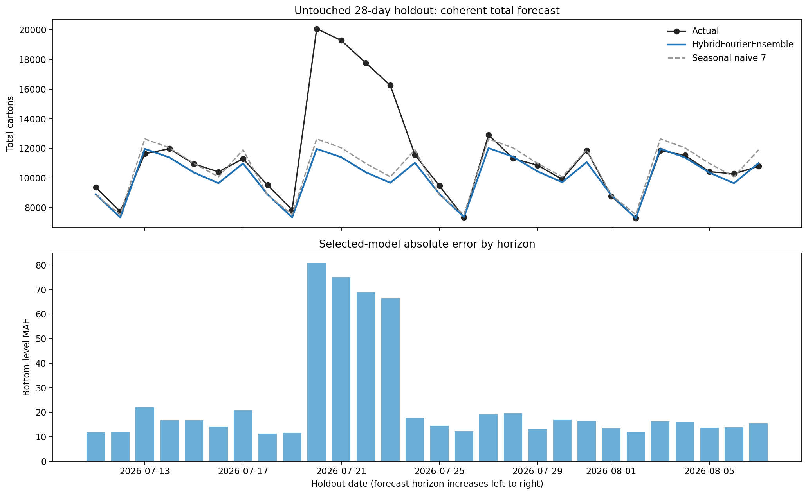
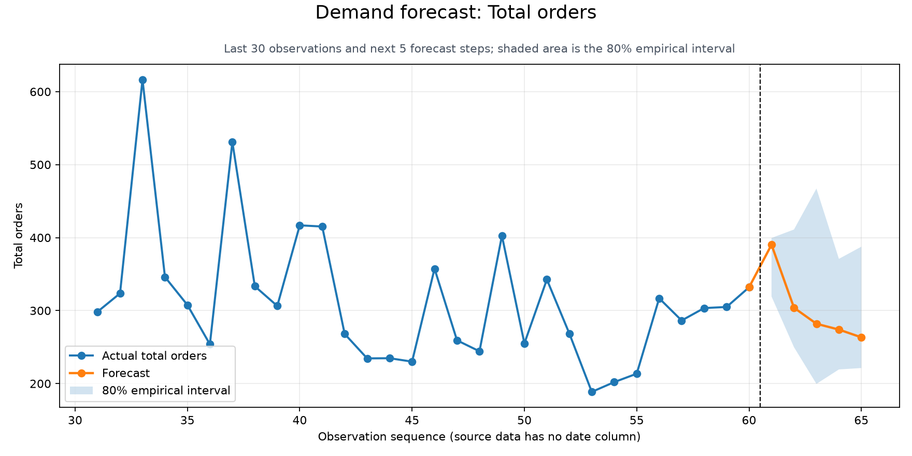
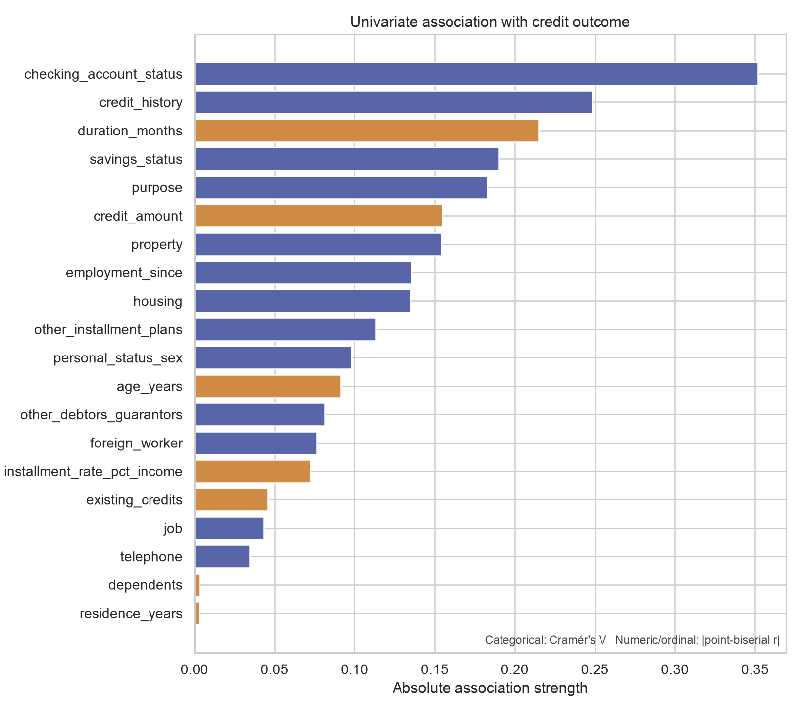

# Machine Learning Projects

A collection of reproducible machine-learning projects focused on demand forecasting, binary classification, leakage-safe evaluation, and decision-ready reporting. The repository currently includes two forecasting pipelines and one credit-classification research benchmark, each with measured results and reproducible artifacts.

## Projects

| Project | Problem | Approach | Status |
|---|---|---|---|
| [Retail Demand Forecast](Retail_Demand_Forecast/) | Forecast daily carton demand across a Country → Region → Chain → Parent SKU hierarchy | Rolling-origin validation, gradient boosting, Fourier regression, forecast reconciliation, and empirical intervals | Complete pipeline and interactive dashboard |
| [Daily Demand Forecasting Orders](Daily_Demand_Forecasting_Orders/) | Forecast the next five working-day order totals from a 60-row UCI dataset | Leakage-safe baselines, weekday means, Ridge regression, expanding-window backtesting, and empirical intervals | Complete compact case study |
| [German Credit Data](German_Credit_Data/) | Predict bad-credit outcomes in the UCI Statlog German Credit dataset | Reproducible EDA, fold-safe preprocessing, feature engineering, GridSearchCV, threshold selection, and subgroup diagnostics | Complete research benchmark; not approved for lending use |

## Highlights

### Hierarchical retail demand forecasting

The retail pipeline forecasts 115 bottom-level series and aggregates them into exactly coherent forecasts at five hierarchy levels. It compares six candidate models, selects on rolling-validation bottom-level WAPE, evaluates once on an untouched holdout, and produces future forecasts with approximate 80% intervals.

In the latest checked-in evaluation run (`--horizon 112 --validation-folds 2`):

- `HybridFourierEnsemble` was selected.
- Bottom-level holdout WAPE was **21.7%**, compared with **59.8%** for last-value naive and **46.2%** for weekly seasonal naive.
- The selected model reduced bottom-level absolute error by **63.7%** versus last-value naive.
- Point forecasts remained coherent across Total, Country, Country–Region, Country–Region–Chain, and Parent SKU levels.

[Read the forecast report](Retail_Demand_Forecast/forecast_report.md) · [Open the live dashboard](https://small-waterfall-e74f.hazirahrafidi.workers.dev)



### Daily logistics order forecasting

This case study uses UCI's Daily Demand Forecasting Orders dataset. Because the source has no true date column and only 60 observations, it uses simple, auditable candidates and preserves row order as the time axis. Same-day order components that reconstruct the target are deliberately excluded to prevent leakage.

The selected weekday-mean model achieved a held-out MAE of **64.65 order units**, a **37.85%** improvement over the five-day seasonal-naive baseline.

[Read the technical report](Daily_Demand_Forecasting_Orders/Report.md)



### German credit classification

This project turns the 1,000-row UCI Statlog German Credit dataset into an end-to-end binary-classification benchmark. It profiles the legacy coded data, keeps an 80/20 stratified holdout untouched during model selection, compares logistic regression, random forest, and histogram gradient boosting against a prevalence baseline, and saves a reload-tested raw-input inference pipeline.

In the checked-in experiment:

- Random Forest was selected using five-fold cross-validated average precision.
- Holdout average precision was **0.670** (bootstrap 95% CI **0.551–0.781**) and ROC-AUC was **0.809** (95% CI **0.743–0.872**).
- A training-only F2 threshold of **0.266** produced **93.3% recall** and **37.8% precision** for bad-credit cases, illustrating the explicit false-positive trade-off.
- The dataset contains sensitive or proxy attributes, lacks timestamps, and is small and historical; the saved model is a research baseline, not an autonomous lending system.

[Read the classification report](German_Credit_Data/Report.md) · [Read the exploratory data report](German_Credit_Data/EDA_Report.md)



## Repository structure

```text
ML-projects/
├── Daily_Demand_Forecasting_Orders/
│   ├── data/                         # Cached UCI dataset
│   ├── outputs/                      # Forecasts, backtests, and chart
│   ├── main.py                       # End-to-end forecasting pipeline
│   └── Report.md                     # Detailed methodology and findings
├── German_Credit_Data/
│   ├── artifacts/eda/figures/        # Checked-in EDA visualizations
│   ├── eda.py                        # Reproducible exploratory analysis
│   ├── feature_processing.py         # Shared training/inference features
│   ├── main.py                       # End-to-end classification pipeline
│   ├── EDA_Report.md                 # Data-quality and pattern analysis
│   └── Report.md                     # Model evaluation and limitations
├── Retail_Demand_Forecast/
│   ├── artifacts/                    # Selected reports, plots, and dashboard
│   ├── data/                         # Retail time-series input
│   ├── build_dashboard.py            # Self-contained HTML dashboard builder
│   ├── dashboard_template.html
│   ├── forecast_report.md
│   └── main.py                       # Hierarchical forecasting pipeline
├── scripts/
│   ├── fetch_data.py                 # Shared UCI fetch/cache helper
│   └── forecast_metrics.py           # MAE, RMSE, MAPE, sMAPE, WAPE, and bias
├── requirements.txt
└── LICENSE
```

## Setup

Clone the repository and install the Python dependencies in a virtual environment:

```bash
git clone https://github.com/haziraf/ML-projects.git
cd ML-projects

python -m venv .venv
source .venv/bin/activate
python -m pip install --upgrade pip
python -m pip install -r requirements.txt
```

The main Python dependencies are pandas, NumPy, scikit-learn, Matplotlib, seaborn, statsmodels, and `ucimlrepo`. The retail dashboard additionally uses Chart.js, installed locally with npm when the dashboard is rebuilt.

## Usage

### 1. Run the retail forecasting pipeline

The default run forecasts 28 days and uses four expanding-window validation folds:

```bash
cd Retail_Demand_Forecast
python main.py
```

To reproduce the configuration used for the checked-in report:

```bash
python main.py \
  --data data/retail_timeseries_2yr.csv \
  --output-dir artifacts \
  --horizon 112 \
  --validation-folds 2
```

The pipeline writes diagnostics, fold metrics, holdout evaluation, feature importance, plots, coherent future forecasts, a run summary, and a Markdown report to `artifacts/`.

The history requirement is:

```text
minimum days = 392 + (validation folds + 1) × forecast horizon
```

Build the self-contained dashboard after the forecast artifacts exist:

```bash
npm install
python build_dashboard.py
```

The result is written to `artifacts/retail_demand_dashboard.html`. Chart.js is embedded in the output, so the finished dashboard does not make network requests.

### 2. Run the daily-orders forecast

Run from the project directory so its relative data and output paths stay local:

```bash
cd ../Daily_Demand_Forecasting_Orders
python main.py
```

If the cached CSV is missing, the script downloads UCI dataset 409 automatically. Useful options include:

```bash
python main.py --horizon 5 --output-dir outputs
python main.py --refresh-data
python main.py --help
```

Generated files include `demand_forecast.csv`, `model_comparison.csv`, `backtest_predictions.csv`, and `demand_forecast.png`.

### 3. Run the German credit analysis

Run the full classification experiment from the repository root:

```bash
python German_Credit_Data/main.py
```

The script downloads UCI dataset 144 when its local cache is absent. It then:

- validates and profiles the 20 predictors and binary target;
- creates two prediction-time-safe credit ratios;
- fits imputation, scaling, one-hot encoding, and feature selection inside each fold;
- tunes three model families with five-fold stratified cross-validation;
- selects a recall-oriented decision threshold from training out-of-fold predictions;
- evaluates once on the untouched holdout; and
- writes a reload-tested `model.joblib`, metrics, diagnostics, plots, and `Report.md`.

Use the reduced grid for a faster end-to-end smoke test:

```bash
python German_Credit_Data/main.py --quick
```

Once `German_Credit_Data/data/german_credit.csv` exists, regenerate the standalone EDA report and audit artifacts with:

```bash
python German_Credit_Data/eda.py
```

Review all supported arguments with `python German_Credit_Data/main.py --help`. The model output is for reproducible research only and has not been validated in a production lending environment.

### 4. Calculate forecast metrics from a CSV

The shared metric utility expects actual and forecast columns:

```bash
python scripts/forecast_metrics.py predictions.csv \
  --actual actual \
  --forecast forecast
```

It prints JSON containing observation count, MAE, RMSE, MAPE, sMAPE, WAPE, and signed bias, where positive bias means overforecasting.

## Modeling principles

- Match validation to the inference setting: chronological splits for forecasting and stratified splits for the IID credit benchmark.
- Fit preprocessing separately inside each validation fold.
- Compare learned models with decision-relevant naive baselines.
- Exclude fields that would not be known when a forecast is issued.
- Preserve the retail hierarchy by forecasting at the bottom level and summing upward.
- Select classification thresholds from training data rather than the final holdout.
- Report uncertainty, subgroup evidence, and limitations alongside aggregate metrics.

The checked-in results describe the supplied datasets and evaluation windows; they are not guarantees of future performance. The retail model does not currently receive future promotions, prices, holidays, stockouts, or campaign plans. The daily-orders dataset lacks real calendar dates and contains only 60 rows. The German Credit dataset is a small legacy snapshot without timestamps or a current applicant-population benchmark, so external validation, calibration, legal review, and a formal fairness assessment are required before any operational consideration.

## License

This repository is available under the [MIT License](LICENSE). Individual datasets remain subject to their source licenses and terms.
